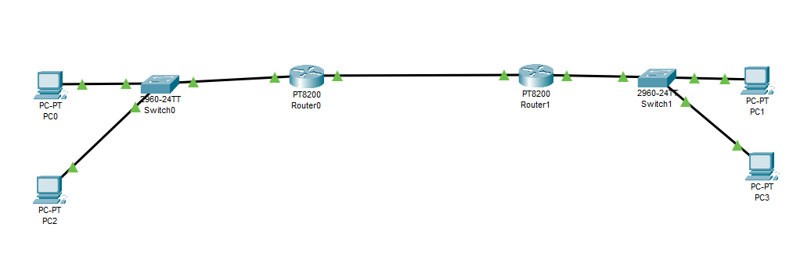

# Cisco Packet Tracer Lab: Observing ARP in Action

This lab demonstrates how **Address Resolution Protocol (ARP)** operates both within a single **Local Area Network (LAN)** and across router hops connecting different subnets.

---

# 🎯 Lab Objectives

By the end of this lab, students will be able to:

- Observe how ARP resolves an IPv4 address to a MAC address.
- Examine the ARP table on PCs and routers.
- Understand ARP behavior within the same subnet.
- Understand ARP behavior when communicating with a different subnet.
- Observe that a PC ARPs for its **default gateway** when the destination is remote.
- Observe ARP occurring independently on each Ethernet segment.
- Understand that routers rebuild the **Layer 2 Ethernet frame** at each routed hop.
- Use Cisco Packet Tracer **Simulation Mode** to observe ARP and ICMP packets.

---


# 1. Network Topology

The lab uses two LANs connected by two routers.

```text
                    LAN 1
              192.168.1.0/24

 PC0                                             PC2
192.168.1.10                                  192.168.1.20
      │                                             │
      └────────────────┬────────────────────────────┘
                       │
                    Switch0
                       │
                       │
                 192.168.1.1
                 Gi0/0/0
                   Router0
                 Gi0/0/1
                  10.0.0.1
                       │
                       │
                 10.0.0.0/24
                       │
                       │
                  10.0.0.2
                 Gi0/0/1
                   Router1
                 Gi0/0/0
                 192.168.2.1
                       │
                    Switch1
                       │
                       │
                      PC1
                 192.168.2.10

                    LAN 2
              192.168.2.0/24
```

---

# 2. IP Address Planning & Setup Table

Assign the following IP addresses, subnet masks, and default gateways:

| Device | Interface | IP Address | Subnet Mask | Default Gateway |
|---|---|---|---|---|
| **PC0** | FastEthernet0 | `192.168.1.10` | `255.255.255.0` | `192.168.1.1` |
| **PC2** | FastEthernet0 | `192.168.1.20` | `255.255.255.0` | `192.168.1.1` |
| **Router0** | GigabitEthernet0/0/0 *(LAN1)* | `192.168.1.1` | `255.255.255.0` | N/A |
| **Router0** | GigabitEthernet0/0/1 *(WAN)* | `10.0.0.1` | `255.255.255.0` | N/A |
| **Router1** | GigabitEthernet0/0/1 *(WAN)* | `10.0.0.2` | `255.255.255.0` | N/A |
| **Router1** | GigabitEthernet0/0/0 *(LAN2)* | `192.168.2.1` | `255.255.255.0` | N/A |
| **PC1** | FastEthernet0 | `192.168.2.10` | `255.255.255.0` | `192.168.2.1` |


---

# 3. Step-by-Step Lab Setup

## Step 1: Configure IP Addresses on the PCs

For each PC:

**Click PC → Desktop → IP Configuration**

### PC0

Configure:

```text
IP Address:       192.168.1.10
Subnet Mask:      255.255.255.0
Default Gateway:  192.168.1.1
```

### PC2

Configure:

```text
IP Address:       192.168.1.20
Subnet Mask:      255.255.255.0
Default Gateway:  192.168.1.1
```

### PC1

Configure:

```text
IP Address:       192.168.2.10
Subnet Mask:      255.255.255.0
Default Gateway:  192.168.2.1
```

---

## Verification: Check PC0's ARP Table

Open:

**PC0 → Desktop → Command Prompt**

Run:

```cmd
arp -a
```

Initially, you may see:

```text
No ARP Entries Found.
```

This gives us a clean starting point before generating network traffic.

---

# 4. Configure Router0

Click:

**Router0 → CLI**

Enter:

```cisco
enable
configure terminal

interface GigabitEthernet0/0/0
 ip address 192.168.1.1 255.255.255.0
 no shutdown
exit

interface GigabitEthernet0/0/1
 ip address 10.0.0.1 255.255.255.0
 no shutdown
exit

ip route 192.168.2.0 255.255.255.0 10.0.0.2

end
```

Router0 now knows:

```text
192.168.1.0/24 → Directly Connected

10.0.0.0/24    → Directly Connected

192.168.2.0/24 → Reach through 10.0.0.2
```

---

# 5. Configure Router1

Click:

**Router1 → CLI**

Enter:

```cisco
enable
configure terminal

interface GigabitEthernet0/0/0
 ip address 192.168.2.1 255.255.255.0
 no shutdown
exit

interface GigabitEthernet0/0/1
 ip address 10.0.0.2 255.255.255.0
 no shutdown
exit

ip route 192.168.1.0 255.255.255.0 10.0.0.1

end
```

Router1 now knows:

```text
192.168.2.0/24 → Directly Connected

10.0.0.0/24    → Directly Connected

192.168.1.0/24 → Reach through 10.0.0.1
```

---

# 6. Verify Router Configuration

On both routers, run:

```cisco
show ip interface brief
```

Verify that the configured interfaces show:

```text
Status      Protocol
up          up
```

You can also inspect the routing table:

```cisco
show ip route
```

And inspect the ARP table:

```cisco
show ip arp
```

---

# 7. Part 1 – Observe ARP Within the Same LAN

We will first ping:

```text
PC0 → PC2
```

Both PCs belong to:

```text
192.168.1.0/24
```

Therefore, they are on the **same subnet**.

---

## Step 1: Switch to Simulation Mode

In Packet Tracer, switch from:

```text
Realtime
```

to:

```text
Simulation
```

You can also use:

```text
Shift + S
```

---

## Step 2: Configure Event Filters

Under **Event List Filters**:

1. Click **Show All/None**.
2. Click **Edit Filters**.
3. Select only:

```text
ARP
ICMP
```

This makes it easier to observe the important packets.

---

## Step 3: Ping PC2 from PC0

On PC0 run:

```cmd
ping 192.168.1.20
```

PC0 wants to send an ICMP Echo Request to:

```text
192.168.1.20
```

But Ethernet delivery also requires the destination's:

```text
MAC Address
```

PC0 therefore needs ARP.

---

# 8. PC0 Determines Whether PC2 Is Local

PC0 compares:

```text
My IP:
192.168.1.10

My Mask:
255.255.255.0

Destination:
192.168.1.20
```

PC0 determines:

```text
192.168.1.10 → 192.168.1.0/24
192.168.1.20 → 192.168.1.0/24
```

Therefore:

```text
SAME SUBNET
```

PC0 does **not** need the router.

Instead, it needs PC2's MAC address.

---

# 9. ARP Request

PC0 generates an ARP request:

```text
Who has 192.168.1.20?
Tell 192.168.1.10
```

Conceptually:

```text
PC0
192.168.1.10
      │
      │ ARP Broadcast
      │
      │ "Who has 192.168.1.20?"
      ▼
    Switch0
      │
      ├──────────────► PC2
      │
      └──────────────► Router0
```

The ARP request is a Layer 2 broadcast.

Its destination MAC address is:

```text
FF:FF:FF:FF:FF:FF
```

---

# 10. PC2 Responds

PC2 examines the ARP request and recognizes:

```text
192.168.1.20
```

as its own IP address.

PC2 sends an ARP reply back to PC0.

Conceptually:

```text
PC0                              PC2
 │                                │
 │  Who has 192.168.1.20?         │
 │───────────────────────────────►│
 │                                │
 │  192.168.1.20 is at MAC-PC2    │
 │◄───────────────────────────────│
```

Unlike the ARP request, the ARP reply is normally **unicast** back to the requester.

---

# 11. PC0 Updates Its ARP Table

PC0 now learns:

```text
192.168.1.20 → PC2's MAC Address
```

The mapping is placed into PC0's ARP cache.

Now PC0 can construct the Ethernet frame carrying the ICMP packet.

```text
Ethernet Frame
┌──────────────────────────────┐
│ Source MAC      = PC0 MAC    │
│ Destination MAC = PC2 MAC    │
│                              │
│ IP Packet                    │
│ Source IP = 192.168.1.10     │
│ Destination = 192.168.1.20   │
│                              │
│ ICMP Echo Request            │
└──────────────────────────────┘
```

---

# 12. Verify PC0's ARP Table

Return to **Realtime Mode**.

On PC0 run:

```cmd
arp -a
```

You should now see an entry mapping:

```text
192.168.1.20
```

to PC2's MAC address.

---

# 13. Part 2 – Observe ARP Across Routers

Now we will ping:

```text
PC0 → PC1
```

PC0:

```text
192.168.1.10/24
```

PC1:

```text
192.168.2.10/24
```

These devices are on **different subnets**.

---

# 14. PC0 Determines That PC1 Is Remote

PC0 performs the same comparison:

```text
PC0:
192.168.1.10/24
       │
       ▼
192.168.1.0/24


PC1:
192.168.2.10/24
       │
       ▼
192.168.2.0/24
```

The networks are different.

Therefore:

```text
DESTINATION IS REMOTE
```

PC0 must send the packet to its:

```text
Default Gateway
```

which is:

```text
192.168.1.1
```

---

# 15. Important ARP Rule

PC0 does **not** ARP for:

```text
192.168.2.10
```

because PC1 is not on PC0's local Ethernet network.

Instead, PC0 ARPs for:

```text
192.168.1.1
```

which is Router0's LAN interface.

---

# 16. Hop 1 – PC0 to Router0

PC0 broadcasts:

```text
Who has 192.168.1.1?
```

Router0 replies with its MAC address.

```text
PC0
192.168.1.10
      │
      │ ARP:
      │ "Who has 192.168.1.1?"
      ▼
Router0
192.168.1.1
      │
      │ ARP Reply
      ▼
PC0 learns Router0's MAC
```

PC0 can now send the packet to Router0.

---

# 17. Layer 2 vs Layer 3 at Hop 1

The frame leaving PC0 looks conceptually like:

```text
ETHERNET
────────────────────────────
Source MAC      = PC0 MAC
Destination MAC = Router0 MAC

IP
────────────────────────────
Source IP       = 192.168.1.10
Destination IP  = 192.168.2.10
```

Notice something extremely important:

```text
Destination MAC = Router0
```

but:

```text
Destination IP = PC1
```

The **MAC address identifies the next hop**.

The **IP address identifies the final destination**.

---

# 18. Hop 2 – Router0 to Router1

Router0 receives the Ethernet frame and removes the Layer 2 header.

It examines the destination IP:

```text
192.168.2.10
```

Router0 checks its routing table.

It finds:

```text
192.168.2.0/24
via 10.0.0.2
```

Therefore, the next hop is:

```text
10.0.0.2
```

Router0 needs Router1's MAC address on the Ethernet WAN segment.

If it does not already know it, Router0 performs ARP:

```text
Who has 10.0.0.2?
```

Router1 replies with its MAC address.

---

# 19. Frame Is Rebuilt

Router0 now creates a **new Layer 2 frame**.

```text
ETHERNET
────────────────────────────
Source MAC      = Router0 WAN MAC
Destination MAC = Router1 WAN MAC

IP
────────────────────────────
Source IP       = 192.168.1.10
Destination IP  = 192.168.2.10
```

Notice:

```text
MAC addresses changed.
```

But the IP source and destination remain associated with the original end hosts during normal routing.

---

# 20. Hop 3 – Router1 to PC1

Router1 receives the packet.

It examines:

```text
Destination IP:
192.168.2.10
```

Router1 knows:

```text
192.168.2.0/24
```

is directly connected.

Router1 therefore needs PC1's MAC address.

It broadcasts:

```text
Who has 192.168.2.10?
```

PC1 responds with its MAC address.

---

# 21. Final Frame

Router1 creates another Ethernet frame:

```text
ETHERNET
────────────────────────────
Source MAC      = Router1 LAN MAC
Destination MAC = PC1 MAC

IP
────────────────────────────
Source IP       = 192.168.1.10
Destination IP  = 192.168.2.10
```

The frame is delivered to PC1.

---

# 22. Complete ARP Flow Across the Network

```text
PC0
192.168.1.10
 │
 │ ARP for 192.168.1.1
 ▼
Router0
192.168.1.1
 │
 │ Route Lookup
 │
 │ ARP for 10.0.0.2
 ▼
Router1
10.0.0.2
 │
 │ Route Lookup
 │
 │ ARP for 192.168.2.10
 ▼
PC1
192.168.2.10
```

There is not one ARP request traveling from PC0 all the way to PC1.

Instead, ARP operates separately on each local Layer 2 segment.

---

# 23. What Changes at Every Router?

This is one of the most important concepts in the lab.

As a packet moves through routers:

```text
Layer 2 MAC Addresses
```

are rebuilt for each Ethernet hop.

Conceptually:

```text
PC0 → Router0
PC0 MAC → Router0 MAC

Router0 → Router1
Router0 MAC → Router1 MAC

Router1 → PC1
Router1 MAC → PC1 MAC
```

Meanwhile, the IP packet continues toward:

```text
Source IP:
192.168.1.10

Destination IP:
192.168.2.10
```

---

# 24. MAC Is Hop-to-Hop; IP Is End-to-End

A simple teaching rule is:

```text
MAC Address = Hop-to-Hop

IP Address  = End-to-End
```

Visualize it as:

```text
 PC0            Router0           Router1            PC1
  │                │                 │                 │
  ├──── MAC ──────►│                 │                 │
  │                ├──── MAC ───────►│                 │
  │                │                 ├──── MAC ───────►│
  │                                                    │
  └────────────────────── IP ─────────────────────────►│
```

---

# 25. Verify Router0's ARP Table

On Router0 run:

```cisco
show ip arp
```

After generating traffic, you may see dynamic mappings such as:

```text
192.168.1.10 → PC0 MAC

10.0.0.2 → Router1 MAC
```

---

# 26. Verify Router1's ARP Table

On Router1 run:

```cisco
show ip arp
```

You may see mappings such as:

```text
10.0.0.1 → Router0 MAC

192.168.2.10 → PC1 MAC
```

---

# 🧪 Student Questions

### Question 1

PC0 wants to communicate with `192.168.1.20`.

What IP does PC0 ARP for?

**Answer:**

```text
192.168.1.20
```

because the destination is on the same subnet.

---

### Question 2

PC0 wants to communicate with `192.168.2.10`.

What IP does PC0 ARP for?

**Answer:**

```text
192.168.1.1
```

because that is PC0's default gateway.

---

### Question 3

Does PC0 ARP directly for PC1's MAC address?

**Answer:**

No.

PC1 is on a different subnet.

---

### Question 4

Does an ARP broadcast cross a router?

**Answer:**

No.

ARP broadcasts remain within their local Layer 2 broadcast domain.

---

### Question 5

What does Router0 ARP for when forwarding toward Router1?

**Answer:**

```text
10.0.0.2
```

which is Router1's next-hop interface.

---

### Question 6

What does Router1 ARP for before delivering the packet to PC1?

**Answer:**

```text
192.168.2.10
```

---

### Question 7

Which addresses change from hop to hop?

**Answer:**

The Layer 2 MAC addresses.

---

### Question 8

Which addresses identify the original source and final destination during normal routing?

**Answer:**

The Layer 3 IP addresses.

---

# 📌 Quick Revision

| Scenario | Device ARPs For |
|---|---|
| PC0 → PC2 | PC2's IP |
| PC0 → PC1 | Router0/default gateway IP |
| Router0 → Router1 | Router1's next-hop IP |
| Router1 → PC1 | PC1's IP |

---

# 📌 Important Commands

| Device | Command | Purpose |
|---|---|---|
| Packet Tracer PC | `arp -a` | Display ARP cache |
| Packet Tracer PC | `ping IP` | Generate traffic |
| Cisco Router | `show ip arp` | Display router ARP table |
| Cisco Router | `show ip route` | Display routing table |
| Cisco Router | `show ip interface brief` | Verify interfaces |
| Cisco Router | `show interfaces` | Inspect interface details |

---

# 🔑 Key Takeaways

- **ARP resolves an IPv4 address to a Layer 2 MAC address on the local network segment.**
- When the destination is on the **same subnet**, the sender ARPs directly for the destination host.
- When the destination is on a **different subnet**, the sender ARPs for its **default gateway**.
- ARP broadcasts do **not** pass through routers.
- Each router may perform its own ARP resolution for the next Ethernet hop.
- Routers remove the incoming Layer 2 frame and create a new Layer 2 frame for the outgoing Ethernet segment.
- Therefore, **MAC addresses change from hop to hop**.
- The source and destination IP addresses identify the end hosts during normal routing.

---

# ⭐ Golden Rule

> **ARP only finds the MAC address needed for the next local Ethernet delivery.**

Remember:

```text
SAME SUBNET
───────────
ARP for Destination Host


DIFFERENT SUBNET
────────────────
ARP for Default Gateway
```

And across a routed network:

```text
PC0
 │
 │ ARP for Gateway
 ▼
Router0
 │
 │ ARP for Next Hop
 ▼
Router1
 │
 │ ARP for Destination
 ▼
PC1
```

### The easiest rule for students to memorize:

```text
MAC = Hop-to-Hop
IP  = End-to-End
ARP = Find the MAC needed for the next local Ethernet hop
```