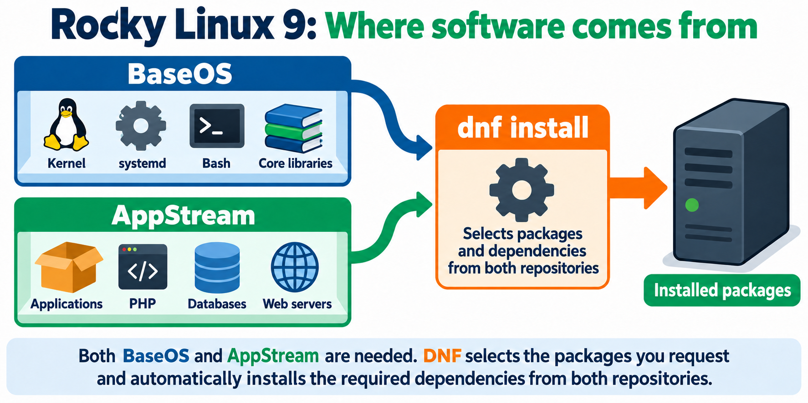

# Linux Project 02: Software Repository Configuration

## RHCSA LAB


## RedHat Exam Question:
Configure the repositories which are available on the repo server at:\
http://repo.eight.example.com/BaseOS \
http://repo.eight.example.com/AppStream

### Explanation:
For the exam/real scenario, the task is to configure access to the specific exam server URLs. On your own VM, check to see if you already have working Rocky repositories, so leave them in place. If you practice adding the exam entries, give them distinct IDs such as [exam-baseos] and [exam-appstream]. The repo.eight.example.com address is intended for the exam network and may not work from your home lab.

## INTRODUCTION
This is a simple problem to solve if you understand what is going on!
Overview Diagram

- Orange path: baseurl= sends DNF directly to your lab server, repo.eight.example.com.
- Teal path: mirrorlist= contacts mirrors.rockylinux.org for server addresses; DNF then downloads packages from an online mirror.
The two mirror servers shown are examples. The mirror list service is the directory, while those servers hold the BaseOS and AppStream packages.

### What is contained in BaseOS and AppStream Repositories?

When we type "dnf install httpd"
1. DNF goes to the configuration file(s), for example, rocky.repo [address book]
2. This points to either mirrolist or baseurl servers holding the packages 

## Scope of Work
# BaseOS and AppStream in Rocky Linux 9
[Official Red Hat documentation: Repositories in RHEL 9](https://docs.redhat.com/en/documentation/red_hat_enterprise_linux/9/html/considerations_in_adopting_rhel_9/ref_repositories_considerations-in-adopting-rhel-9)

On your **Rocky Linux 9** VM, BaseOS and AppStream are software repositories: collections of packages that `dnf` can download and update.
To see which repository offers a particular package:
```bash
dnf info bash
dnf info python3
```

In short: BaseOS runs the system; AppStream supplies much of the software you run on it.

| Repository | What it provides | Think of it as |
|---|---|---|
| **BaseOS** | Core operating system components, such as the kernel and essential system tools | The foundation of the house |
| **AppStream** | Additional applications, programming languages, runtimes, and databases | The tools and services you put in the house |

Both are normal parts of Rocky Linux. When you run `dnf install`, DNF checks the enabled repositories and downloads the requested package and its required dependencies.

> Simplified Flow Diagram
.png>)

## STEP-1: How do we find the list of repositories (repo) in our linux VM (Virtual Machine)?
```bash
[root@nitacademy ~]# dnf repolist
repo id                                                repo name
appstream                                              Rocky Linux 9 - AppStream
baseos                                                 Rocky Linux 9 - BaseOS
docker-ce-stable                                       Docker CE Stable - x86_64
extras                                                 Rocky Linux 9 - Extras
```
## STEP-2: How do you check the STATUS of each repository
dnf repolist --all tells you which repository entries exist.
```bash
[root@nitacademy ~]# dnf repolist --all
repo id                      repo name                                                                        status
appstream                    Rocky Linux 9 - AppStream                                                        enabled
appstream-debuginfo          Rocky Linux 9 - AppStream - Debug                                                disabled
appstream-source             Rocky Linux 9 - AppStream - Source                                               disabled
baseos                       Rocky Linux 9 - BaseOS                                                           enabled
```

## STEP-3  Configuration file - we will know which server addresses those enabled repositories use.

The files in /etc/yum.repos.d/ 
```bash
[root@nitacademy ~]# cd /etc/yum.repos.d/
[root@nitacademy yum.repos.d]# pwd
/etc/yum.repos.d
[root@nitacademy yum.repos.d]# ll
total 28
-rw-r--r--. 1 root root  811 May 16 22:01 docker-ce.repo
-rw-r--r--. 1 root root 6610 May  8 12:31 rocky-addons.repo
-rw-r--r--. 1 root root 1165 May  8 12:31 rocky-devel.repo
-rw-r--r--. 1 root root 2387 May  8 12:31 rocky-extras.repo
-rw-r--r--. 1 root root 3417 May  8 12:31 rocky.repo
-rw-r--r--. 1 root root 1425 May  8 12:31 rocky-security.repo
```

> Remember any new file created must always end in .repo 
> Configuration file => /etc/yum.repos.d/rocky.repo tells DNF where to find software.
```shell
[root@nitacademy yum.repos.d]# cat rocky.repo
# rocky.repo
#
# The mirrorlist system uses the connecting IP address of the client and the
# update status of each mirror to pick current mirrors that are geographically
# close to the client.  You should use this for Rocky updates unless you are
# manually picking other mirrors.
#
# If the mirrorlist does not work for you, you can try the commented out
# baseurl line instead.

[baseos]
name=Rocky Linux $releasever - BaseOS
mirrorlist=https://mirrors.rockylinux.org/mirrorlist?arch=$basearch&repo=BaseOS-$releasever$rltype
#baseurl=http://dl.rockylinux.org/$contentdir/$releasever/BaseOS/$basearch/os/
gpgcheck=1
enabled=1
countme=1
metadata_expire=6h
gpgkey=file:///etc/pki/rpm-gpg/RPM-GPG-KEY-Rocky-9

[baseos-debuginfo]
name=Rocky Linux $releasever - BaseOS - Debug
mirrorlist=https://mirrors.rockylinux.org/mirrorlist?arch=$basearch&repo=BaseOS-$releasever-debug$rltype
#baseurl=http://dl.rockylinux.org/$contentdir/$releasever/BaseOS/$basearch/debug/tree/
gpgcheck=1
enabled=0
metadata_expire=6h
gpgkey=file:///etc/pki/rpm-gpg/RPM-GPG-KEY-Rocky-9

[baseos-source]
name=Rocky Linux $releasever - BaseOS - Source
mirrorlist=https://mirrors.rockylinux.org/mirrorlist?arch=source&repo=BaseOS-$releasever-source$rltype
#baseurl=http://dl.rockylinux.org/$contentdir/$releasever/BaseOS/source/tree/
gpgcheck=1
enabled=0
metadata_expire=6h
gpgkey=file:///etc/pki/rpm-gpg/RPM-GPG-KEY-Rocky-9

[appstream]
name=Rocky Linux $releasever - AppStream
mirrorlist=https://mirrors.rockylinux.org/mirrorlist?arch=$basearch&repo=AppStream-$releasever$rltype
#baseurl=http://dl.rockylinux.org/$contentdir/$releasever/AppStream/$basearch/os/
gpgcheck=1
enabled=1
countme=1
metadata_expire=6h
gpgkey=file:///etc/pki/rpm-gpg/RPM-GPG-KEY-Rocky-9

[appstream-debuginfo]
name=Rocky Linux $releasever - AppStream - Debug
mirrorlist=https://mirrors.rockylinux.org/mirrorlist?arch=$basearch&repo=AppStream-$releasever-debug$rltype
#baseurl=http://dl.rockylinux.org/$contentdir/$releasever/AppStream/$basearch/debug/tree/
gpgcheck=1
enabled=0
metadata_expire=6h
gpgkey=file:///etc/pki/rpm-gpg/RPM-GPG-KEY-Rocky-9

[appstream-source]
name=Rocky Linux $releasever - AppStream - Source
mirrorlist=https://mirrors.rockylinux.org/mirrorlist?arch=source&repo=AppStream-$releasever-source$rltype
#baseurl=http://dl.rockylinux.org/$contentdir/$releasever/AppStream/source/tree/
gpgcheck=1
enabled=0
metadata_expire=6h
gpgkey=file:///etc/pki/rpm-gpg/RPM-GPG-KEY-Rocky-9
```
### Configuration file Explained
We need to understand the following Terminologies:
1. mirrorlist: this gives DNF addresses of available download servers.
   - Mirror servers: hold the BaseOS and AppStream package catalogs and RPM files.
2. baseurl: this is the direct address to a server within a network
3. gpgcheck: This tells DNF to verify the digital signature on each RPM Package before installing it.
   - gpgcheck=1 means check is on;
   - gpgcheck=0 means check is off (IF no key. In the exam this select gpgcheck=0)
4. gpgkey
   - This tells DNF to find Rocky's Public Key for that verification
   - file:// means the key file is in the localhost. /etc/pki/rpm-gpg
5. enabled: Use or not to use this repository
   - enabled=0
   - enabled=1
```shell
Note:
- DNF: compares those catalogs with what your VM has installed, then downloads and installs needed updates.
- Important Note: An exam question not mentioning a key does not by itself prove that gpgcheck=0 is required. A suitable key might already be  installed. In a practice lab, gpgcheck=0 is commonly used to keep the exercise focused on configuring the two URLs. For a real repository, keep signature checking on and configure the correct key whenever signed packages and that key are available.
```

| Line | Summary Descriptions|
|---|---|
| `[baseos]` | This section’s **repository ID** is `baseos`. That is the ID shown by `dnf repolist`. |
| `name=...` | A readable name for people. `$releasever` is filled in by DNF; on this Rocky 9 system, it displays as `9`. |
| `mirrorlist=...` | Ask Rocky’s mirror service for a list of servers that carry BaseOS packages. The mirror list is **not itself the package warehouse**; it gives DNF warehouse addresses. |
| `#baseurl=...` | An alternative direct address. The `#` means it is **currently inactive**. DNF is using `mirrorlist`, not this `baseurl`. |
| `gpgcheck=1` | Check downloaded RPM packages against a trusted cryptographic signature before installing them. `1` means on. |
| `enabled=1` | DNF is allowed to use this repository. This is why `baseos` appears in `dnf repolist`. |
| `countme=1` | Allows Rocky to estimate how many systems use its mirrors during normal DNF requests. It does not install anything. |
| `metadata_expire=6h` | After six hours, DNF checks whether its cached **package catalog** needs updating. It does not mean installed packages expire after six hours. |
| `gpgkey=file:///...` | The location of Rocky’s public signing key **on your VM**. DNF uses it for the signature check. `file://` means a local file, not a web address. |


```shell
NOTES:
- Reference: [DNF configuration reference](https://dnf.readthedocs.io/en/latest/conf_ref.html).
- In the mirror URL, `$basearch` means your system’s architecture, such as `x86_64`; `$releasever` identifies the release. `$rltype` is a Rocky specific value used when forming the requested repository name. **DNF substitutes these values** before contacting the mirror service—you do not type replacements into this file yourself.
```

Whether they are additional repositories depends on what is already configured:
- If your VM has no working BaseOS and AppStream entries, this file supplies them.
- If it already has entries for them, you are pointing DNF to another source for the same kinds of packages. You should avoid reusing the same repository IDs ([baseos] and [appstream]) in two files.
For the exam, a safe way to distinguish the supplied sources is to name their IDs [exam-baseos] and [exam-appstream]. The IDs can be your own names; the baseurl values must match the addresses in the question exactly.
---

# REDHAT EXAM QUESTION #2
Configure the repositories which are available on the repo server at:
http://repo.eight.example.com/BaseOS
http://repo.eight.example.com/AppStream

- The exam task is asking you to create a single .repo file and add two configurations to that file
 using the exact URLs shown.
- This has to be done on the exam VM. 

## Solution:
### STEP-1
The easiest thing to do is to **create a repository file**, for example, **eight.repo**:
**On your Rocky VM, [baseos] is already used in rocky.repo. Do not use [baseos] again in eight.repo: repository IDs must be unique across all .repo files. Changing only the capitalization to [baseOS] may give it a distinct ID, but it is easy to confuse with the original.**
For the exam you need only
- name=
- baseurl=
- enabled=1
- gpgcheck=0


1. Create a file that tells DNF the two addresses:
```bash
vi /etc/yum.repos.d/eight.repo
```
Press i to enter insert mode, then type:
```bash
[eight-baseos]
name=EightBaseOS
baseurl=http://repo.eight.example.com/BaseOS
enabled=1
gpgcheck=0

[eight-appstream]
name=EightAppStream
baseurl=http://repo.eight.example.com/AppStream
enabled=1
gpgcheck=0
```

| Line | Purpose|
|---|---|
| `[baseos]` | Give this warehouse a short ID. |
| `name=BaseOS` | Give it a readable name. |
| `baseurl=.../BaseOS` | Here is its address. |
| `enabled=1` | Let DNF use it. |
| `gpgcheck=0` | No signing key was supplied in this question. |


### STEP-2 - Testing our new Repositories
The file `/etc/yum.repos.d/rocky.repo` as well as `/etc/yum.repos.d/eight.repo` tells DNF where to find Rocky Linux software. 
Both are enabled, so DNF can use both when resolving an installation.
- Your VM currently says, in effect: **“Ask Rocky’s mirror service where to get BaseOS and AppStream.”**
- The exam question says: **“Configure DNF to get them from these exact addresses on `repo.eight.example.com`.”** That is why the exam solution uses `baseurl=`: the question provides **direct repository addresses**, so there is no mirror list to ask.
Run:
```bash
dnf clean all
```
Then run:
```bash
[root@nitacademy yum.repos.d]# dnf repolist
repo id                                                repo name
appstream                                              Rocky Linux 9 - AppStream
baseos                                                 Rocky Linux 9 - BaseOS
docker-ce-stable                                       Docker CE Stable - x86_64
eight-appstream                                        EightAppstream
eight-baseos                                           EightBaseos
extras                                                 Rocky Linux 9 - Extras
```
Let us also Check if New respositories are **enabled**
Run:
```bash
[root@nitacademy yum.repos.d]# dnf repolist --all
eight-appstream              EightAppstream                                                                   enabled
eight-baseos                 EightBaseos                                                                      enabled
```
Finally run:
```bash
dnf makecache
```
- Note: dnf makecache downloads and saves the package catalogs (metadata) from enabled repositories. The catalogs tell DNF which packages and versions are available and what dependencies they need. It does not install or update packages

> If both repositories appear and dnf makecache succeeds, your VM can reach the two software warehouses. The exam server address works inside the exam environment; you would not expect that example address to work on your home or any other evironment running Rocky Linux VM.

#### DNF Cache Commands

Think of the cache as DNF’s saved copy of a store catalog.

| Command | What it does |
| --- | --- |
| `dnf clean all` | Throws away saved repository catalogs and cached downloads. |
| `dnf makecache` | Fetches fresh repository catalogs from the enabled repositories. |
| `dnf install httpd` | Finds and installs `httpd` and its needed dependencies. |

In your exam exercise, after changing from Rocky’s `mirrorlist=` to the exam server’s `baseurl=`, you should run:

```bash
dnf clean all
dnf makecache
```

That forces DNF to fetch metadata afresh, making it easier to spot an incorrect URL or unreachable repository server. You do not need to run `dnf clean all` before every install; DNF normally manages cache freshness itself.


## STEP-3: Refresh only these repositories

```bash
dnf clean all
dnf makecache --disablerepo='*'   --enablerepo=Eightbaseos,Eightappstream

dnf repolist --disablerepo='*'   --enablerepo=Eightbaseos,Eightappstream
```

### STEP-4: Confirm and install Apache using the new **eight.repo** file:

```bash
dnf info httpd --disablerepo='*'   --enablerepo=Eightbaseos,Eightappstream

dnf install -y httpd --disablerepo='*'   --enablerepo=Eightbaseos,Eightappstream
rpm -q httpd                      #Checking RPM - RHEL Package Manager
```


### Troubleshooting Guide 
**Layer 1 (Physical Layer): Check Physical Cables**
```bash
run:
[root@nitacademy yum.repos.d]# nmcli con show
NAME             UUID                                  TYPE      DEVICE
enX0             8059132c-ef59-3024-8cc3-2b2a495896af  ethernet  enX0
br-377e78284d53  437f1cbf-eea3-4ced-af6f-6c5dbca11b46  bridge    br-377e78284d53
lo               1a996560-c29e-4ede-a0e3-89afe5db2596  loopback  lo
docker0          6b0aead6-b070-4bf2-a266-1d780f004c0c  bridge    docker0
[root@nitacademy yum.repos.d]# ethtool enX0
Settings for enX0:
        Link detected: yes
```
**RESULT: NIC CARD IS UP (Available), Cable Connection is OK**

**Layer 3 (Network Layer): Gateway or Router issue**
if the VM’s default gateway changes to an incorrect address, dnf install httpd will normally fail when it needs to reach Rocky’s public mirrors. The gateway is how your VM sends traffic to destinations outside its local subnet.

 DNS is a separate requirement: it turns names such as mirrors.rockylinux.org into IP addresses.
```bash
Run:
cat /etc/resolv.conf                    # Which DNS server is configured? The "home box" (PTCL,MTN,AT&T)
```
First, test name resolution for a System Level Check:
```bash
getent hosts mirrors.rockylinux.org
```
**getent means “get entries.” It asks Linux to look up information using the system’s configured sources.**
- With hosts, it looks up a hostname using the **host resolution rules** in /etc/nsswitch.conf, which can include /etc/hosts and DNS (/etc/resolv.conf). That makes it useful for checking whether the name works from the VM’s point of view.

If getent above returns an IP address, your VM can resolve the name. To install dig and nslookup on Rocky 9, install bind-utils
```bash
dnf install bind-utils -y
#Now Try the following commands:
dig mirrors.rockylinux.org
nslookup mirrors.rockylinux.org
```
**Both dig and nslookup ask a DNS server to translate a name into an IP address. The main difference is how much detail they show.**
This Topic is covered in more detail in our Networking Class.

Layer 3 (Network Layer) - ICMP Echo Request - ICMP Echo Reply
**ping** sends an ICMP Echo Request, and the target may return an ICMP Echo Reply. ICMP travels inside an IP packet; it does not use TCP or UDP ports.

---

# REAL JOB WORK
## 1. Business Scenario
Company - NEXUS installs software only from approved repositories. Company has decided to create a local respository Server for all in-house updates as part of its vulnerability iniitative. You have been hired as a Linux System Admin. The first part of the project is already done, that is, Configuring and Provisioning a New Server that will provide all the respositories. (This is already done by another team)

**What are you being hired to do? PATCHING!!!**
1. Intially you will test a single VM by creating a new respository file.
2. Then you will create an Ansible Ad-hoc command to test if this change can be implemented on a VM.
3. Finally, you will run Ansible Playbook and then use Ansible Tower to implement this company wide change.
4. You will also make sure you take backups
5. Rollback if issues come up during patching.
6. Cleanup 


### Step 3: Test the locations

```bash
curl -I --max-time 10 "$BASEOS_URL/"
curl -I --max-time 10 "$APPSTREAM_URL/"
```


## Completion Checklist

- [ ] Correct VM confirmed
- [ ] Backup created before patching
- [ ] Original state recorded
- [ ] Configuration completed
- [ ] Validation passed
- [ ] SELinux remains enforcing
- [ ] firewalld remains enabled
- [ ] Reboot persistence tested when required
- [ ] Evidence collected
- [ ] Rollback understood

## 10. Review Questions

1. What business problem did this project solve?
2. Which command proved the configuration was active?
3. Which command proved it was persistent?
4. What could fail, and how would you roll back?
